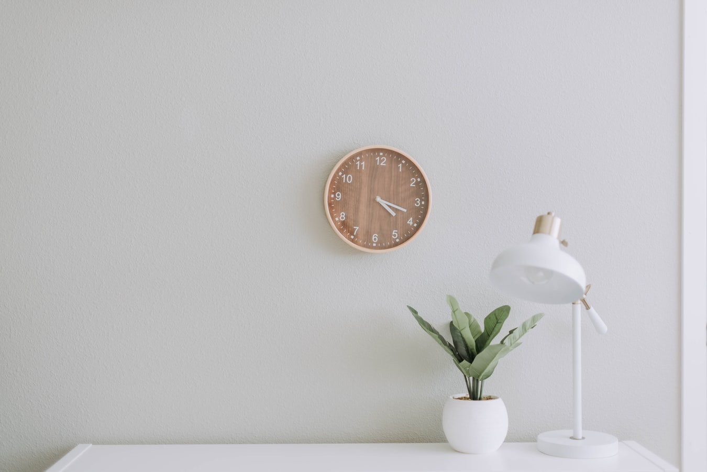
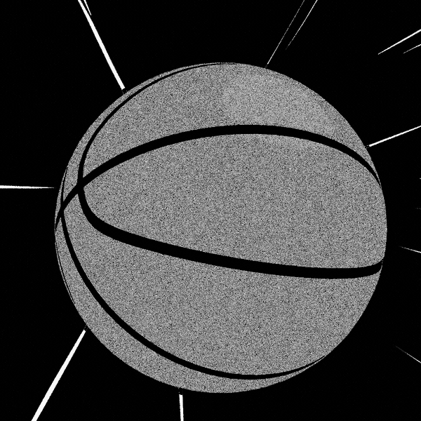
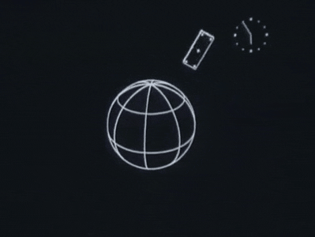
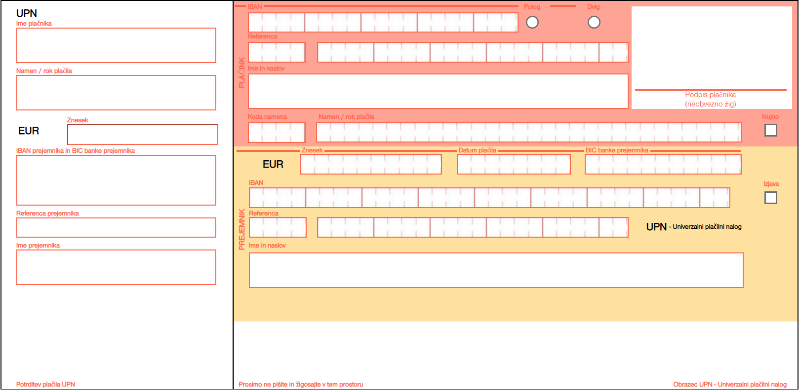

# EsmirPortfolija
<!DOCTYPE html>
		<!--[if lt IE 7]>      <html class="no-js lt-ie9 lt-ie8 lt-ie7"> <![endif]-->
		<!--[if IE 7]>         <html class="no-js lt-ie9 lt-ie8"> <![endif]-->
		<!--[if IE 8]>         <html class="no-js lt-ie9"> <![endif]-->
		<!--[if gt IE 8]><!--> <html class="no-js"> <!--<![endif]-->

		<head>
			<meta charset="utf-8">
			<meta http-equiv="X-UA-Compatible" content="IE=edge">
			<title>PortfolioEsmir - Slider Revolution</title>
			<meta name="description" content="Slider Revolution Example" />
			<meta name="keywords" content="fullscreen image, grid layout, flexbox grid, transition" />
			<meta name="author" content="ThemePunch" />
			<meta name="viewport" content="width=device-width, initial-scale=1">

			<!-- LOAD JQUERY LIBRARY -->
			
			
			<!-- LOADING FONTS AND ICONS -->
			<link href="https://fonts.googleapis.com/css?family=Roboto:400%2C500%7CPoppins:800" rel="stylesheet" property="stylesheet" media="all" type="text/css" >

			
			<link rel="stylesheet" type="text/css" href="fonts/pe-icon-7-stroke/css/pe-icon-7-stroke.css">
			<link rel="stylesheet" type="text/css" href="fonts/font-awesome/css/font-awesome.css">
			
			<!-- REVOLUTION STYLE SHEETS -->
			<link rel="stylesheet" type="text/css" href="css/rs6.css">
			<!-- REVOLUTION LAYERS STYLES -->
						<!-- REVOLUTION JS FILES -->
			
			
			
			
		</head>
		
		

			<!-- START PortfolioEsmir REVOLUTION SLIDER 6.1.3 -->

			<rs-module-wrap id="rev_slider_42_1_wrapper" data-alias="PortfolioEsmir" data-source="gallery" style="background:transparent;padding:0;">
				<rs-module id="rev_slider_42_1" style="display:none;" data-version="6.1.3">
					<rs-slides>
						<rs-slide data-key="rs-100" data-title="Slide" data-anim="ei:d;eo:d;s:1000;r:0;t:fade;sl:0;">
							
<!--
							--><rs-layer
								id="slider-42-slide-100-layer-0" 
								data-type="text"
								data-color="#0c0404"
								data-rsp_ch="on"
								data-xy="x:c;xo:-219px;y:117px;"
								data-text="w:normal;s:60;l:70;ls:-1;"
								data-dim="minh:0px;"
								data-frame_999="o:0;st:w;"
								style="z-index:5;font-family:Roboto;text-transform:uppercase;"
							>Portfolio-Esmir Hajdic 
							</rs-layer><!--

							--><rs-layer
								id="slider-42-slide-100-layer-5" 
								data-type="text"
								data-color="#0c0c0c"
								data-rsp_ch="on"
								data-xy="x:45px;y:199px;"
								data-text="w:normal;s:22;l:37;"
								data-frame_999="o:0;st:w;"
								style="z-index:7;font-family:Roboto;"
							>Sem Esmir Hajdić , dijak srednje računalniške šole v Novi Gorici. 
Na tem spletnem mestu lahko najdete moje delo. 
							</rs-layer><!--

							--><rs-layer
								id="slider-42-slide-100-layer-6" 
								class="rev-btn"
								data-type="button"
								data-color="#ffffff"
								data-rsp_ch="on"
								data-xy="x:42px;y:301px;"
								data-text="w:normal;s:33;l:78;fw:500;"
								data-dim="w:451.391px;"
								data-actions='o:click;a:jumptoslide;slide:next;'
								data-padding="r:49;l:49;"
								data-border="bos:solid;boc:rgba(255,255,255,0.35);bow:1px,1px,1px,1px;"
								data-frame_999="o:0;st:w;"
								data-frame_hover="c:#fff;bgc:rgba(0,0,0,0);boc:rgba(255,255,255,0.75);bor:0px,0px,0px,0px;bos:solid;bow:1px,1px,1px,1px;e:Power1.easeInOut;"
								style="z-index:8;background-color:rgba(12,12,12,0.69);font-family:Roboto;"
							>Oglej si portfolio tukaj! 
							</rs-layer><!--
-->						</rs-slide>
						<rs-slide data-key="rs-101" data-title="Slide" data-anim="ei:d;eo:d;s:1000;r:0;t:fade;sl:0;">
							
<!--
							--><rs-layer
								id="slider-42-slide-101-layer-9" 
								data-type="text"
								data-color="#fff"
								data-rsp_ch="on"
								data-xy="x:c;xo:2px;y:191px;"
								data-text="w:normal;s:80;l:90;ls:-4;fw:800;a:center;"
								data-dim="w:865px;minh:0px;"
								data-frame_999="o:0;st:w;"
								style="z-index:6;font-family:Poppins;"
							>Prijavnica za tekmovanje v košarki 
							</rs-layer><!--

							--><a
								id="slider-42-slide-101-layer-10" 
								class="rs-layer rev-btn"
								href="https://drive.google.com/file/d/1qmjLMeufw9p3Dg6Ny5oEAglzdhQKHAGa/view?usp=sharing" target="_self" rel="nofollow"
								data-type="button"
								data-color="#ffffff"
								data-rsp_ch="on"
								data-xy="x:c;y:c;"
								data-text="w:normal;l:50;fw:500;"
								data-dim="minh:0px;"
								data-padding="r:20;l:20;"
								data-frame_999="o:0;st:w;"
								data-frame_hover="c:#000;bgc:#fff;bor:0px,0px,0px,0px;sp:200;e:Power1.easeInOut;"
								style="z-index:7;background-color:rgba(0,0,0,1);font-family:Roboto;"
							>Prenesi 
							</a><!--

							--><rs-layer
								id="slider-42-slide-101-layer-13" 
								class="rev-btn"
								data-type="button"
								data-color="#ffffff"
								data-rsp_ch="on"
								data-xy="x:100px;y:b;yo:100px;"
								data-text="w:normal;s:17;l:40;fw:500;"
								data-dim="minh:0px;"
								data-actions='o:click;a:jumptoslide;slide:previous;'
								data-padding="r:25;l:25;"
								data-border="bos:solid;boc:rgba(255,255,255,0.35);bow:1px,1px,1px,1px;"
								data-frame_999="o:0;st:w;"
								data-frame_hover="bgc:rgba(0,0,0,0);boc:rgba(255,255,255,0.75);bor:0px,0px,0px,0px;bos:solid;bow:1px,1px,1px,1px;e:Power1.easeInOut;"
								style="z-index:9;background-color:rgba(0,0,0,0);font-family:Roboto;"
							>Nazaj 
							</rs-layer><!--

							--><rs-layer
								id="slider-42-slide-101-layer-14" 
								class="rev-btn"
								data-type="button"
								data-color="#ffffff"
								data-rsp_ch="on"
								data-xy="x:r;xo:100px;y:b;yo:100px;"
								data-text="w:normal;s:17;l:40;fw:500;"
								data-dim="minh:0px;"
								data-actions='o:click;a:jumptoslide;slide:next;'
								data-padding="r:25;l:25;"
								data-border="bos:solid;boc:rgba(255,255,255,0.35);bow:1px,1px,1px,1px;"
								data-frame_999="o:0;st:w;"
								data-frame_hover="bgc:rgba(0,0,0,0);boc:rgba(255,255,255,0.75);bor:0px,0px,0px,0px;bos:solid;bow:1px,1px,1px,1px;e:Power1.easeInOut;"
								style="z-index:8;background-color:rgba(0,0,0,0);font-family:Roboto;"
							>Naprej 
							</rs-layer><!--
-->						</rs-slide>
						<rs-slide data-key="rs-102" data-title="Slide" data-anim="ei:d;eo:d;s:1000;r:0;t:fade;sl:0;">
							
<!--
							--><rs-layer
								id="slider-42-slide-102-layer-16" 
								class="rev-btn"
								data-type="button"
								data-color="#ffffff"
								data-rsp_ch="on"
								data-xy="x:100px;y:b;yo:100px;"
								data-text="w:normal;s:17;l:40;fw:500;"
								data-dim="minh:0px;"
								data-actions='o:click;a:jumptoslide;slide:previous;'
								data-padding="r:25;l:25;"
								data-border="bos:solid;boc:rgba(255,255,255,0.35);bow:1px,1px,1px,1px;"
								data-frame_999="o:0;st:w;"
								data-frame_hover="bgc:rgba(0,0,0,0);boc:rgba(255,255,255,0.75);bor:0px,0px,0px,0px;bos:solid;bow:1px,1px,1px,1px;e:Power1.easeInOut;"
								style="z-index:9;background-color:rgba(0,0,0,0);font-family:Roboto;"
							>Nazaj 
							</rs-layer><!--

							--><rs-layer
								id="slider-42-slide-102-layer-17" 
								class="rev-btn"
								data-type="button"
								data-color="#ffffff"
								data-rsp_ch="on"
								data-xy="x:r;xo:100px;y:b;yo:100px;"
								data-text="w:normal;s:17;l:40;fw:500;"
								data-dim="minh:0px;"
								data-actions='o:click;a:jumptoslide;slide:next;'
								data-padding="r:25;l:25;"
								data-border="bos:solid;boc:rgba(255,255,255,0.35);bow:1px,1px,1px,1px;"
								data-frame_999="o:0;st:w;"
								data-frame_hover="bgc:rgba(0,0,0,0);boc:rgba(255,255,255,0.75);bor:0px,0px,0px,0px;bos:solid;bow:1px,1px,1px,1px;e:Power1.easeInOut;"
								style="z-index:8;background-color:rgba(0,0,0,0);font-family:Roboto;"
							>Naprej 
							</rs-layer><!--

							--><rs-layer
								id="slider-42-slide-102-layer-18" 
								data-type="text"
								data-color="#fff"
								data-rsp_ch="on"
								data-xy="x:c;y:272px;"
								data-text="w:normal;s:80;l:90;ls:-4;fw:800;"
								data-dim="minh:0px;"
								data-frame_999="o:0;st:w;"
								style="z-index:5;font-family:Poppins;"
							>Labirint 
							</rs-layer><!--

							--><a
								id="slider-42-slide-102-layer-19" 
								class="rs-layer rev-btn"
								href="https://drive.google.com/file/d/1ZXBJtKjp4K24Lj8kNqY0CK8EAJAcpz4R/view?usp=sharing" target="_self" rel="nofollow"
								data-type="button"
								data-color="#ffffff"
								data-rsp_ch="on"
								data-xy="x:c;y:c;"
								data-text="w:normal;l:50;fw:500;"
								data-dim="minh:0px;"
								data-padding="r:20;l:20;"
								data-frame_999="o:0;st:w;"
								data-frame_hover="c:#000;bgc:#fff;bor:0px,0px,0px,0px;sp:200;e:Power1.easeInOut;"
								style="z-index:11;background-color:rgba(0,0,0,1);font-family:Roboto;"
							>Prenesi 
							</a><!--
-->						</rs-slide>
						<rs-slide data-key="rs-103" data-title="Slide" data-anim="ei:d;eo:d;s:1000;r:0;t:fade;sl:0;">
							
<!--
							--><rs-layer
								id="slider-42-slide-103-layer-21" 
								data-type="text"
								data-color="#fff"
								data-rsp_ch="on"
								data-xy="x:c;y:272px;"
								data-text="w:normal;s:80;l:90;ls:-4;fw:800;"
								data-dim="minh:0px;"
								data-frame_999="o:0;st:w;"
								style="z-index:5;font-family:Poppins;"
							>Bazier curve 
							</rs-layer><!--

							--><a
								id="slider-42-slide-103-layer-23" 
								class="rs-layer rev-btn"
								href="https://drive.google.com/file/d/1Goo7emk18Kh0TzuHI_EYmqos6YQva0yO/view?usp=sharing" target="_self" rel="nofollow"
								data-type="button"
								data-color="#ffffff"
								data-rsp_ch="on"
								data-xy="x:c;y:c;"
								data-text="w:normal;l:50;fw:500;"
								data-dim="minh:0px;"
								data-padding="r:20;l:20;"
								data-frame_999="o:0;st:w;"
								data-frame_hover="c:#000;bgc:#fff;bor:0px,0px,0px,0px;sp:200;e:Power1.easeInOut;"
								style="z-index:6;background-color:rgba(0,0,0,1);font-family:Roboto;"
							>Prenesi 
							</a><!--

							--><rs-layer
								id="slider-42-slide-103-layer-28" 
								class="rev-btn"
								data-type="button"
								data-color="#ffffff"
								data-rsp_ch="on"
								data-xy="x:100px;y:b;yo:100px;"
								data-text="w:normal;s:17;l:40;fw:500;"
								data-dim="minh:0px;"
								data-actions='o:click;a:jumptoslide;slide:previous;'
								data-padding="r:25;l:25;"
								data-border="bos:solid;boc:rgba(255,255,255,0.35);bow:1px,1px,1px,1px;"
								data-frame_999="o:0;st:w;"
								data-frame_hover="bgc:rgba(0,0,0,0);boc:rgba(255,255,255,0.75);bor:0px,0px,0px,0px;bos:solid;bow:1px,1px,1px,1px;e:Power1.easeInOut;"
								style="z-index:9;background-color:rgba(0,0,0,0);font-family:Roboto;"
							>Nazaj 
							</rs-layer><!--

							--><rs-layer
								id="slider-42-slide-103-layer-29" 
								class="rev-btn"
								data-type="button"
								data-color="#ffffff"
								data-rsp_ch="on"
								data-xy="x:r;xo:100px;y:b;yo:100px;"
								data-text="w:normal;s:17;l:40;fw:500;"
								data-dim="minh:0px;"
								data-actions='o:click;a:jumptoslide;slide:next;'
								data-padding="r:25;l:25;"
								data-border="bos:solid;boc:rgba(255,255,255,0.35);bow:1px,1px,1px,1px;"
								data-frame_999="o:0;st:w;"
								data-frame_hover="bgc:rgba(0,0,0,0);boc:rgba(255,255,255,0.75);bor:0px,0px,0px,0px;bos:solid;bow:1px,1px,1px,1px;e:Power1.easeInOut;"
								style="z-index:8;background-color:rgba(0,0,0,0);font-family:Roboto;"
							>Naprej 
							</rs-layer><!--
-->						</rs-slide>
						<rs-slide data-key="rs-104" data-title="Slide" data-anim="ei:d;eo:d;s:1000;r:0;t:fade;sl:0;" data-mediafilter="xpro2">
							
<!--
							--><rs-layer
								id="slider-42-slide-104-layer-24" 
								data-type="text"
								data-color="#0c0c0c"
								data-rsp_ch="on"
								data-xy="x:c;y:272px;"
								data-text="w:normal;s:80;l:90;ls:-4;fw:800;"
								data-dim="minh:0px;"
								data-frame_999="o:0;st:w;"
								style="z-index:9;font-family:Poppins;"
							>UPN Položnica 
							</rs-layer><!--

							--><a
								id="slider-42-slide-104-layer-25" 
								class="rs-layer rev-btn"
								href="https://drive.google.com/file/d/1NQie-Wflf1PXvVUIDCYoBwYSV6fEgo9p/view?usp=sharing" target="_self" rel="nofollow"
								data-type="button"
								data-color="#ffffff"
								data-rsp_ch="on"
								data-xy="x:c;y:c;"
								data-text="w:normal;l:50;fw:500;"
								data-dim="minh:0px;"
								data-padding="r:20;l:20;"
								data-frame_999="o:0;st:w;"
								data-frame_hover="c:#000;bgc:#fff;bor:0px,0px,0px,0px;sp:200;e:Power1.easeInOut;"
								style="z-index:10;background-color:rgba(0,0,0,1);font-family:Roboto;"
							>Prenesi 
							</a><!--

							--><rs-layer
								id="slider-42-slide-104-layer-26" 
								class="rev-btn"
								data-type="button"
								data-color="#ffffff"
								data-rsp_ch="on"
								data-xy="x:100px;y:b;yo:100px;"
								data-text="w:normal;s:17;l:40;fw:500;"
								data-dim="minh:0px;"
								data-actions='o:click;a:jumptoslide;slide:previous;'
								data-padding="r:25;l:25;"
								data-border="bos:solid;boc:rgba(255,255,255,0.35);bow:1px,1px,1px,1px;"
								data-frame_999="o:0;st:w;"
								data-frame_hover="bgc:rgba(0,0,0,0);boc:rgba(255,255,255,0.75);bor:0px,0px,0px,0px;bos:solid;bow:1px,1px,1px,1px;e:Power1.easeInOut;"
								style="z-index:12;background-color:rgba(0,0,0,0);font-family:Roboto;"
							>Nazaj 
							</rs-layer><!--

							--><rs-layer
								id="slider-42-slide-104-layer-27" 
								class="rev-btn"
								data-type="button"
								data-color="#ffffff"
								data-rsp_ch="on"
								data-xy="x:r;xo:100px;y:b;yo:100px;"
								data-text="w:normal;s:17;l:40;fw:500;"
								data-dim="minh:0px;"
								data-actions='o:click;a:jumptoslide;slide:next;'
								data-padding="r:25;l:25;"
								data-border="bos:solid;boc:rgba(255,255,255,0.35);bow:1px,1px,1px,1px;"
								data-frame_999="o:0;st:w;"
								data-frame_hover="bgc:rgba(0,0,0,0);boc:rgba(255,255,255,0.75);bor:0px,0px,0px,0px;bos:solid;bow:1px,1px,1px,1px;e:Power1.easeInOut;"
								style="z-index:11;background-color:rgba(0,0,0,0);font-family:Roboto;"
							>Naprej 
							</rs-layer><!--

							--><rs-layer
								id="slider-42-slide-104-layer-35" 
								data-type="shape"
								data-rsp_ch="on"
								data-xy="x:c;y:c;"
								data-text="w:normal;"
								data-dim="w:3675;h:2205;"
								data-frame_999="o:0;st:w;"
								style="z-index:8;background-color:rgba(0,0,0,0.5);font-family:Roboto;"
							> 
							</rs-layer><!--
-->						</rs-slide>
					</rs-slides>
					<rs-static-layers><!--
					--></rs-static-layers>
					<rs-progress class="rs-bottom" style="visibility: hidden !important;"></rs-progress>
				</rs-module>
		
			</rs-module-wrap>
			<!-- END REVOLUTION SLIDER -->

				

		<body>
					</body>
		
		</html>
		
